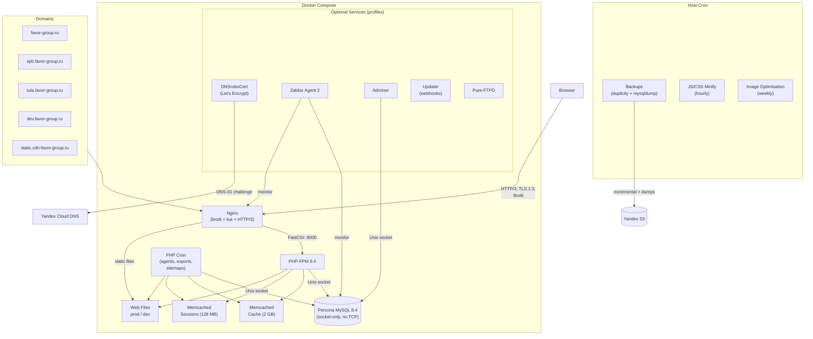
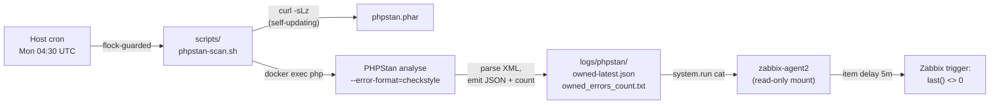

# Bitrix infrastructure as a code [](https://github.com/paskal/bitrix.infra/actions/workflows/ci-build.yml) [](https://github.com/paskal/bitrix.infra/actions/workflows/ci-build-php.yml) [](https://github.com/paskal/bitrix.infra/actions/workflows/ci-pull.yml)

This repository contains infrastructure code behind Bitrix-based [site](https://favor-group.ru) of my father's metal decking business operating in multiple cities.

It's a Bitrix website completely enclosed within docker-compose to be as portable and maintainable as possible, and a set of scripts around its maintenance like dev site redeploy or production site backup.

## Architecture



The site serves three regions (Moscow, St Petersburg, Tula) via subdomains, each with its own robots.txt, sitemap, redirect map, and product export feeds. All traffic goes through a single nginx instance with HTTP/3 (QUIC), brotli compression, and multi-layer bot detection. MySQL is accessible only via Unix socket (no TCP port exposed). Backups run to Yandex Object Storage: incremental file backups via duplicity daily, MySQL dumps twice daily.

## Is it fast?

You bet! Here is a performance on Yandex.Cloud server with Intel Cascade Lake 8 vCPUs, 16Gb of RAM and 120Gb SSD 4000 read\write IOPS and 60Mb/s bandwidth.


## What's inside?

### Core

- [Nginx](https://www.nginx.com/) ([ghcr.io/paskal/nginx](https://github.com/paskal/bitrix.infra/pkgs/container/nginx)) with [brotli](https://github.com/google/ngx_brotli), HTTP/3 (QUIC) and Lua modules — proxies requests to php-fpm and serves static assets directly
- [php-fpm](https://www.php.net/manual/en/install.fpm.php) 8.3 / 8.4 / 8.5 ([ghcr.io/paskal/bitrix-php](https://github.com/paskal/bitrix.infra/pkgs/container/bitrix-php)) for Bitrix with msmtp for mail sending
- [Percona MySQL 8.4](https://www.percona.com/software/mysql-database/percona-server) because of its monitoring capabilities
- [memcached](https://memcached.org/) for Bitrix cache and user sessions

### Multi-region setup

The site serves three cities — Moscow (`favor-group.ru`), Saint Petersburg (`spb.favor-group.ru`) and Tula (`tula.favor-group.ru`) — from a single Bitrix installation, database and document root. The Bitrix `aspro.max` module handles region-aware content, while nginx and cron scripts handle the SEO layer.

<details><summary>How multi-region SEO works</summary>

- **robots.txt** — nginx rewrites `/robots.txt` to `/aspro_regions/robots/robots_$host.txt`, so each subdomain gets its own file. A cron script (`alter-robots-txt.sh`, every 10 minutes, lives in the private overlay) patches these files after Bitrix regenerates them: Moscow indexes everything, SPb blocks `/info/blog/` (centralised on Moscow to avoid duplicate content), Tula additionally blocks `/montag/` and `/projects/` which don't exist for that region.
- **sitemaps** — nginx rewrites `/sitemap*.xml` to `/aspro_regions/sitemap/sitemap*_$host.xml`. Four cron jobs generate them nightly: `sitemap.bitrix.php`, `sitemap.aspro.php`, `sitemap.offers.php` and `sitemap.regions.php`.
- **redirect maps** — `nginx/sites/redirects-map.conf` in the private overlay contains four `map` blocks: one per region (`$new_uri_msk`, `$new_uri_spb`, `$new_uri_tula`) for region-specific redirects (e.g. Tula bounces all `/montag/` and `/projects/` URLs to Moscow), plus a global `$new_uri` map for site-wide URL cleanup.

</details>

### Yandex Metrika cookie extension

Safari's [Intelligent Tracking Prevention](https://webkit.org/blog/category/privacy/) (ITP) limits cookies set by JavaScript to 7 days (24 hours in some cases). This means the Metrika visitor identifier (`_ym_uid`) expires between visits, causing returning visitors to appear as new ones in analytics. Following [Yandex's official recommendation](https://yandex.ru/support/metrica/general/safari-cookie.html), nginx re-sets the Metrika cookies (`_ym_uid`, `_ym_d`, `_ym_ucs`) server-side via `Set-Cookie` headers with a 1-year lifetime — browsers respect the full expiry for server-set cookies.

<details><summary>Implementation details</summary>

The implementation uses nginx `map` blocks (`config/nginx/conf.d/metrika-cookies.conf`) rather than `if` directives to avoid the ["if is evil"](https://www.nginx.com/resources/wiki/start/topics/depth/ifisevil/) problem — using `add_header` inside an `if` block replaces all parent-level headers, which would drop `Cache-Control`, security headers and CSP from static file responses. When the cookie is absent the map resolves to an empty string and no header is emitted. The headers are emitted only on document responses (the PHP location), never on static assets — Safari refuses to disk-cache any response carrying `Set-Cookie`.

The feature is on by default: the cookie domain is auto-derived from the host (last two labels), and the headers are only emitted for visitors that already carry a `_ym_uid` cookie, so sites without Metrika are unaffected. Sites on multi-level public suffixes (`.co.uk`, `.com.tr`) should pin the domain via a `private/nginx/metrika-domain.map` entry.

</details>

### Optional

- PHP cron container (`php-cron`) with same settings as PHP serving web requests
- [adminer](https://www.adminer.org/) (`adminer`) as phpMyAdmin alternative for work with MySQL
- [pure-ftpd](https://www.pureftpd.org/project/pure-ftpd/) (`ftp`) for FTP access
- [DNSroboCert](https://github.com/adferrand/dnsrobocert) (`certbot`) for Let's Encrypt HTTPS certificate generation
- [zabbix-agent2](https://www.zabbix.com/zabbix_agent) (`zabbix-agent`, [ghcr.io/paskal/zabbix-agent2](https://github.com/paskal/bitrix.infra/pkgs/container/zabbix-agent2)) for monitoring
- Webhooks server (`updater`) for automated tasks.

### Automation (host cron)

These run on the host machine outside Docker, scheduled via `config/cron/host.cron`:

- **JS/CSS minification** — runs hourly via [`tdewolff/minify`](https://github.com/tdewolff/minify) Docker image on `web/prod/local` and `web/dev/local`, producing `.min.js`/`.min.css` files
- **Image optimisation** — runs weekly (Saturday night) via `scripts/optimise-images.sh`, processing PNG ([optipng](http://optipng.sourceforge.net/) + [advpng](https://www.advancemame.it/comp-readme)), JPEG ([jpegoptim](https://github.com/tjko/jpegoptim)), WebP ([cwebp](https://developers.google.com/speed/webp/docs/cwebp)) and GIF ([gifsicle](https://www.lcdf.org/gifsicle/)) in `web/prod/upload`. Uses a SQLite database to track already-processed files and avoid redundant work
- **Log rotation** — configured in `config/logrotate/` for nginx (weekly for production access logs at 100 MB minimum, monthly for others) and PHP (monthly for error, cron and msmtp logs). Nginx logs are reopened via `nginx -s reopen`, PHP-FPM via `USR1` signal

### PHPStan static analysis monitoring

Bitrix sites accumulate type-strictness bugs that PHP 8.x will tolerate at parse time but blow up at runtime — methods like `mysqli::real_escape_string()` started rejecting non-string arguments in 8.x, and a Bitrix codebase that worked for years on 7.x can have dozens of latent `TypeError`s waiting for a specific code path to fire. PHPStan catches them, but only if it's run regularly against the *deployed* code (not your local working copy).

This infrastructure runs PHPStan weekly against the prod Bitrix tree, counts the findings in code you own, writes the count to a file, and lets the Zabbix agent read it via `system.run` — so a non-zero count becomes a regular monitoring alert instead of being discovered six months later in Sentry.



**Design — drive to zero, no baseline file.** The metric is *the number of errors in code you wrote*, and the target is zero. There is no baseline JSON, no fingerprint diff, no rebaseline ritual. If a PHPStan upgrade adds a new rule that surfaces new findings, you fix them or add a scoped `ignoreErrors` entry to the neon — the same workflow as a regression caught the normal way. This is why the PHAR is allowed to auto-update on every run (`curl -sLz` does a conditional GET, zero traffic when unchanged).

**Two scopes:**
- **Owned** (`phpstan-owned.neon`, alerted): code you wrote — `local/`, `bitrix/php_interface/init.php`, `bitrix/php_interface/include`. This is what Zabbix watches.
- **Diagnostic** (`phpstan-diagnostic.neon`, manual): broader sweep including Bitrix-injected scaffold. Run on-demand with `./scripts/phpstan-scan.sh --diagnostic` when the owned count jumps weirdly and you want to check whether a path change accidentally scoped in vendor code. Never alerted on.

Both scopes use `scanDirectories` against the live `/web/prod/bitrix/modules` tree for symbol resolution — no Bitrix stubs to maintain, always in sync with the deployed version.

**File locations:**

| Path | Purpose |
|---|---|
| `scripts/phpstan-scan.sh` | Entrypoint script (flock-guarded, self-updates the PHAR, runs in `php` container) |
| `private/phpstan/phpstan-owned.neon` | Scope + rule config for the alerted scan (copy from `phpstan-owned.neon.example` and adapt) |
| `private/phpstan/phpstan-owned.neon.example` | Generic starting point — copy to `phpstan-owned.neon` and adapt paths |
| `private/phpstan/phpstan-diagnostic.neon` | Broader scope for manual troubleshooting (site-specific; lives in private repo) |
| `config/zabbix/templates/phpstan-monitoring.yaml` | Zabbix 7.4 template (three items, three triggers — count + freshness + failure-marker) |
| `logs/phpstan/owned_errors_count.txt` | Single integer the Zabbix agent reads |
| `logs/phpstan/owned-latest.json` | Full findings, file + line + identifier — open this when the trigger fires |

**How to enable in your own fork:**

1. **Mount the neon configs and log directory.** `docker-compose.yml` already wires this up — `private/phpstan` is mounted read-only into the `php` and `php-cron` containers at `/phpstan`, and `logs/phpstan` is mounted read-write into both PHP containers and read-only into `zabbix-agent`. Create the host log directory before first start, matching the UID/GID used by your `php` container's `www-data` user: `mkdir -p logs/phpstan && sudo chown $(docker exec php id -u www-data):$(docker exec php id -g www-data) logs/phpstan && sudo chmod 2775 logs/phpstan`. In this repo's base image that's UID 1000; verify with `docker exec php id www-data` if you've swapped to a different image. The setgid bit keeps group inheritance for files PHPStan writes. **If your PHP container is not named `php` / `php-cron`,** also edit the two `docker exec -u www-data … php` lines in `scripts/phpstan-scan.sh` to match your container names.
2. **Adapt the neon paths to your tree.** Both neons reference `/web/prod/local`, `/web/prod/bitrix/php_interface/...` — fine for the layout this repo assumes, but change them if your `web/prod` lives elsewhere. The `excludePaths` list is curated to skip third-party module trees that ship inside `php_interface/include/` on this codebase; review and prune for yours.
3. **Wire the cron entry.** Already present in `config/cron/host.cron`: `30 4 * * 1 root cd $INFRA_DIR && ./scripts/phpstan-scan.sh >>/web/logs/phpstan/cron.log 2>&1`. Weekly Monday 04:30 UTC. Adjust to suit your low-traffic window. Cron stdout/stderr is appended to `logs/phpstan/cron.log` so the diagnostic prints around a failed run survive for post-mortem (the script writes sentinels for Zabbix, but the cron-log line tells you *which* run died and how far it got).
4. **Import the Zabbix template.** Via the Zabbix API (recommended — repeatable, no manual UI clicks):
   ```python
   from zabbix_utils import ZabbixAPI
   import os
   api = ZabbixAPI(url=os.environ["ZABBIX_URL"])
   api.login(token=os.environ["ZABBIX_TOKEN"])
   with open("config/zabbix/templates/phpstan-monitoring.yaml") as f:
       api.configuration.import_(
           source=f.read(), format="yaml",
           rules={
               "templates":       {"createMissing": True, "updateExisting": True},
               "items":           {"createMissing": True, "updateExisting": True},
               "triggers":        {"createMissing": True, "updateExisting": True},
               "template_groups": {"createMissing": True},
           },
       )
   ```
   Then link the `PHPStan monitoring` template to the host running your zabbix-agent (`host.update` with the existing templates list preserved, plus the new templateid appended — `host.update` *replaces* the list rather than appending).
5. **Stabilise before linking the template to a host.** All three triggers ship `status: ENABLED` so re-imports stay healthy without an extra re-arm step. The flip-side is that linking the template before the system has scanned once will fire the count/freshness triggers immediately. Order of operations on a fresh install:
   1. Run a manual scan (`./scripts/phpstan-scan.sh`), fix what surfaces in `logs/phpstan/owned-latest.json`, repeat until `logs/phpstan/owned_errors_count.txt` reads `0` — this makes the count trigger silent and the XML file fresh enough to silence the freshness trigger.
   2. *Then* link the template to your zabbix-agent host. If you can't get the count to zero on day one, link the template anyway and silence the count trigger per-host via the Zabbix UI (Hosts → host → Triggers → check, mass-update) or temporarily flip it to DISABLED at template level via `api.trigger.update(triggerid=<id>, status=1)`. Re-imports of the YAML will re-enable it.
   3. The failure-marker trigger only fires when the script writes a sentinel — it is silent on a healthy fresh install regardless of order.

The single weekly scan takes ~2–4 minutes on a Cascade Lake 8-vCPU host (cold cache; warm re-run is ~1 minute). `flock` prevents the cron run from colliding with a manual invocation.

### Bitrix configuration

These are the relevant Bitrix config files that connect the CMS to the dockerised services (memcached for sessions/cache, MySQL via socket, cron agents). Documentation: sessions [1](https://training.bitrix24.com/support/training/course/?COURSE_ID=68&LESSON_ID=24868) [2](https://training.bitrix24.com/support/training/course/?COURSE_ID=68&LESSON_ID=24870) (ru [1](https://dev.1c-bitrix.ru/learning/course/index.php?COURSE_ID=43&LESSON_ID=14026&LESSON_PATH=3913.3435.4816.14028.14026), [2](https://dev.1c-bitrix.ru/learning/course/?COURSE_ID=32&LESSON_ID=9421)), [cache](https://training.bitrix24.com/support/training/course/?COURSE_ID=68&CHAPTER_ID=05962&LESSON_PATH=5936.5959.5962) ([ru](https://dev.1c-bitrix.ru/learning/course/?COURSE_ID=43&LESSON_ID=2795))

<details><summary>bitrix/php_interface/dbconn.php</summary>

```php
// Enable cron-based agent execution
define('BX_CRONTAB_SUPPORT', true);

// Database connection (legacy, also configured in .settings.php)
$DBType = "mysql";
$DBHost = "localhost";
$DBName = "<DBNAME>";
$DBLogin = "<DBUSER>";
$DBPassword = "<DBPASSWORD>";

// Temporary files directory
define('BX_TEMPORARY_FILES_DIRECTORY', '/tmp');

// Standard Bitrix configuration
define("BX_UTF", true);
define("BX_FILE_PERMISSIONS", 0644);
define("BX_DIR_PERMISSIONS", 0755);
@umask(~(BX_FILE_PERMISSIONS|BX_DIR_PERMISSIONS)&0777);
define("BX_DISABLE_INDEX_PAGE", true);
```

</details>

<details><summary>bitrix/.settings.php</summary>

```php
  'session' => array (
  'value' =>
  array (
    'mode' => 'separated',
    'lifetime' => 14400,
    'handlers' =>
    array (
      'kernel'  => 'encrypted_cookies',
      'general' =>
      array (
        'type' => 'memcache',
        'host' => 'memcached-sessions',
        'port' => '11211',
      ),
    ),
  ),
  'readonly' => true,
  ),
  'connections' =>
  array (
    'value' =>
    array (
      'default' =>
      array (
        'className' => '\\Bitrix\\Main\\DB\\MysqliConnection',
        'host' => 'localhost',
        'database' => '<DBNAME>',
        'login' => '<DBUSER>',
        'password' => '<DBPASSWORD>',
        'options' => 3,
      ),
    ),
    'readonly' => true,
  ),
```

</details>

<details><summary>bitrix/.settings_extra.php</summary>

```php
<?php
return array(
  'cache' => array(
    'value' => array(
      // For PHP 8.0+ use memcached instead of deprecated memcache.
      // The php-memcached extension is actively maintained, works with libmemcached
      // and provides better performance on modern PHP versions.
      'type' => 'memcached',
      'memcached' => array(
        'host' => 'memcached',
        'port' => '11211',
      ),

      // The igbinary serializer reduces cache size by ~50% compared to
      // the standard PHP serializer and is faster at deserialization.
      // Value 2 = Memcached::SERIALIZER_IGBINARY
      // Requires php-igbinary extension to be installed
      'serializer' => 2,

      // Lock mode (use_lock) prevents simultaneous cache regeneration
      // by multiple processes. Under high load, only one process
      // generates cache, others receive stale data.
      // Requires Bitrix main module version 24.0.0 or higher.
      // More info: https://dev.1c-bitrix.ru/learning/course/?COURSE_ID=43&LESSON_ID=3485
      'use_lock' => true,

      'sid' => $_SERVER["DOCUMENT_ROOT"]."#01"
    ),
  ),
);
?>
```

</details>

## Getting Started

1.  **Clone the repository:**
    ```bash
    git clone https://github.com/paskal/bitrix.infra.git
    cd bitrix.infra
    ```

2.  **Create environment files:**
    Copy the example files in `private/environment/` and fill in your values:
    ```bash
    for f in private/environment/*.env.example; do cp "$f" "${f%.example}"; done
    ```
    Edit each `.env` file — the examples contain comments explaining every variable. At minimum you need `mysql.env`; the others are for optional services (FTP, monitoring, certificates, webhooks).

    Optionally copy `.env.example` to `.env` to override ports or other compose variables (e.g. if port 80 is taken on the host):
    ```bash
    cp .env.example .env
    ```

3.  **Set file permissions and create required directories:**
    MySQL uses UID/GID 1001, PHP and Nginx use UID/GID 1000. Run the provided script — it also creates all directories that docker file-mounts need:
    ```bash
    sudo ./scripts/fix-rights.sh
    ```

4.  **Start the services:**
    ```bash
    docker-compose up -d
    ```
    Pre-built images are pulled from GHCR automatically. You only need `--build` if you've modified the Dockerfiles locally. To enable optional services, see [Managing Optional Services with Profiles](#managing-optional-services-with-profiles).

    > **Note:** bare `docker compose up -d` starts the core stack (nginx, php, php-cron, mysql, both memcached). Optional services (`adminer`, `updater`, `certbot`, `zabbix-agent`, `ftp`) are behind profiles — enable them with `COMPOSE_PROFILES` or `--profile` when needed.

For information about maintenance and utility scripts, see [scripts/README.md](scripts/README.md).

## Local demo

A fresh clone boots a working Bitrix installer at `http://localhost` without changing any tracked file (only the documented setup commands below):

1. Clone and create env files (steps 1–2 above).
2. `sudo ./scripts/fix-rights.sh` — on Linux hosts the `chown` calls matter (container UIDs 1000/1001); on macOS Docker Desktop (VirtioFS) only the directory creation does, and the script run without `sudo` creates the directories and cleanly skips the ownership fixes.
3. `docker compose up -d`
4. Download the Bitrix trial package (~313 MB) and extract it into `web/prod/`:
   ```bash
   curl -L https://www.1c-bitrix.ru/download/start_encode.tar.gz | tar -xz -C web/prod/
   ```
   Alternatively, place `bitrixsetup.php` there for a minimal bootstrap.
5. Open `http://localhost` (or `http://localhost:${HTTP_PORT}` if you changed the port in `.env`).
6. In the Bitrix wizard, use `localhost` as the database host (MySQL communicates via Unix socket), database name from `mysql.env` (`MYSQL_DATABASE`), and the user credentials from the same file.

> **Local overrides without touching tracked files:** `docker-compose.override.yml` is gitignored, so laptop-specific tweaks belong in your own override next to `docker-compose.yml` rather than in edits to tracked configs:
>
> ```yaml
> services:
>   mysql:
>     volumes:
>       - ./private/my-local.cnf:/etc/my.cnf.d/zz-local.cnf:ro   # e.g. innodb_buffer_pool_size = 512M
>   php:
>     volumes:
>       - ./private/php-local.ini:/etc/php/8.4/fpm/conf.d/99-local.ini:ro
> ```
>
> Typical `private/php-local.ini` for a demo: `session.cookie_secure = Off` (Chromium treats `localhost` as a secure context, but Firefox and curl-driven wizard runs discard the Secure session cookie over plain HTTP and silently freeze on the licence step) and `opcache.jit = disable` (PHP 8.4 JIT has been observed to segfault php-fpm workers on arm64 hosts, surfacing as 502s after the install). The shipped `config/mysql/my.cnf` is sized for a dedicated server (4 GB buffer pool) — shrink it in `my-local.cnf` for an 8 GB Docker Desktop VM.

## Production overlay (private repo)

Production identity (TLS certificates, site vhosts, site-specific cron jobs, CSP headers, etc.) is kept in a separate private repository and attached to this base via a `docker-compose.override.yml`. The mechanism:

1. The private repo is checked out alongside the public one (e.g. at `/web/private/` on the server).
2. A `docker-compose.override.yml` in the private repo is symlinked next to `docker-compose.yml`. Docker Compose merges them automatically on every `docker compose` invocation.
3. The override re-adds `container_name:` for all services (so scripts that reference containers by name keep working), re-maps `config/updater.yaml` to the private tasks file, and sets production environment variables.
4. Site vhosts live in `private/nginx/sites/*.conf` — the public `nginx.conf` already includes that glob; an empty directory is a no-op on a fresh clone.
5. A second `/etc/cron.d` file (mounted by the override) carries site-specific host cron jobs (seo-reindex, robots.txt patching, etc.).
6. Behavioural knobs in the shared nginx files (hotlink protection, the `X-Frame-Options` value, admin-page `frame-ancestors`/CORS) are driven by maps in `config/nginx/conf.d/overlay-maps.conf`; the overlay extends them by dropping `*.map` files into `private/nginx/` — see the comments in that file for the expected entries.

> **Security note:** a fresh public clone serves **no `Content-Security-Policy`** — the CSP includes are globs that match nothing until an overlay supplies `private/nginx/bitrix_csp_headers.conf` / `static_csp_headers.conf` (deliberate: a copy-pasted CSP is worse than none). Before pointing a real domain at this stack, create those files; a minimal starting point is `add_header Content-Security-Policy "default-src 'self';" always;`.

To start the regular production stack: `COMPOSE_PROFILES=certs,dbadmin,monitoring,hooks docker compose up -d`.

> **Required for ALL ongoing ops, not just startup:** once the overlay is active, `nginx` `depends_on` the profile-gated `adminer`/`updater`, so *every* `docker compose` command, including `ps`, `logs`, `restart` and `down`, fails with `service "nginx" depends on undefined service "updater"` unless `COMPOSE_PROFILES` is set. Export it for the session (`export COMPOSE_PROFILES=certs,dbadmin,monitoring,hooks`) or prefix each invocation. `scripts/disaster-recovery.sh` sets this default itself. Do not include the manual FTP profile in this default.

## File structure

### /config

- `cron/php-cron.cron` — cron tasks for the php-cron container. Only the standard `cron_events.php` Bitrix runner is kept here; site-specific jobs belong in a private overlay cron.d file. [Must](https://manpages.ubuntu.com/manpages/jammy/man8/cron.8.html) be owned by root:root with mode 0644 — run `scripts/fix-rights.sh` to fix.

- `cron/host.cron` — cron tasks for the host machine (backups, image optimisation, JS/CSS minification, DNS token renewal). Site-specific jobs (seo-reindex, robots.txt patching) live in the private overlay.

- `mysql/my.cnf` — MySQL configuration, applied on top of the package-provided defaults. Sized for a dedicated server (`innodb_buffer_pool_size = 4G`); shrink for local demos on laptops.

- `nginx` directory — build Dockerfile and shared nginx configuration:
    - `nginx.conf` — main http block (brotli, gzip, SSL, logging)
    - `bitrix.conf` — Bitrix-specific location rules (dot-path deny, static serving, FastCGI)
    - `fastcgi.conf` — FastCGI params including HTTP/3-safe `HTTP_HOST`
    - `security_headers.conf` — `X-Content-Type-Options`, `X-Frame-Options`, `Referrer-Policy`
    - `static-cdn.conf` — CDN vhost include (static-only, hotlink protection)
    - `bots.conf` — bot detection logic
    - `conf.d/localhost.conf` — HTTP-only demo server on port 80 for a fresh clone
    - `conf.d/host-map.conf` — `$bitrix_host` map (preserves `:port` for local demos, falls back to `$host` for QUIC)
    - `conf.d/upstream.conf`, `bad_ips.conf`, `status.conf`, `useragents.conf` — generic infrastructure
    - Site vhosts live in the private overlay (`private.conf.d/sites/*.conf`)

- `php` directory contains the build Dockerfiles (`Dockerfile.8.3`, `Dockerfile.8.4`, `Dockerfile.8.5`) and php configuration, applied on top of package-provided one.

- `logrotate` directory contains rotation configs for nginx and PHP logs, applied on the host via symlinks in `/etc/logrotate.d/` pointing to `config/logrotate/*`. The symlinks are created by `scripts/disaster-recovery.sh`; on a fresh manual setup, run `ln -sf /web/config/logrotate/* /etc/logrotate.d/` once.

### /logs

`mysql`, `nginx`, `php` logs. cron and msmtp logs will be written to the `php` directory.

### /scripts

Maintenance and utility scripts for the infrastructure. See [scripts/README.md](scripts/README.md) for detailed documentation of each script.

### /bin

CLI tools: `fgmysql` (read-only MySQL access via SSH tunnel) and `search-reindex` (Yandex/Bing URL reindexing). See [scripts/README.md](scripts/README.md#bin-directory-tools) for setup and usage.

### /web

Site files in directories `web/prod` and `web/dev`.

### /private

- `private/environment/` — environment files for docker-compose services. Copy `.env.example` files to `.env` and fill in your values. Each example file is commented with descriptions of every variable:
    - `mysql.env` — Percona MySQL credentials (root, application user, read-only agent user)
    - `dnsrobocert.env` — Yandex Cloud DNS credentials for Let's Encrypt wildcard certificates (`certs` profile)
    - `zabbix.env` — Zabbix Agent 2 configuration (hostname, server address, key restrictions) (`monitoring` profile)
    - `updater.env` — webhook server shared secret (`hooks` profile)
    - `ftp.env` — Pure-FTPD credentials (`ftp` profile)
    - `seo-reindex.env` — Yandex Webmaster OAuth token and quota host for the daily SEO reindex cron
    - `backup.env` — S3 bucket, endpoint URL, and domain for backup scripts

- `private/nginx/` — nginx include snippets mounted as `private.conf.d`. CSP include globs (`bitrix_csp_headers*.conf`, `static_csp_headers*.conf`) match nothing if the directory is empty, so nginx starts on a fresh clone without any stubs. Drop your CSP files here on production.

- `private/updater_ssh_key` — SSH private key mounted into the `updater` container; required by the `hooks` profile

- `private/letsencrypt/` — filled with certificates after the `certbot` service runs

- `private/mysql-data/` — MySQL data directory (created automatically on first start)

- `private/mysqld/` — MySQL Unix socket for connections without network

- `private/msmtprc` — [msmtp configuration](https://wiki.archlinux.org/index.php/Msmtp) for PHP mail sending

## Composite site (Bitrix "Композит")

nginx is preconfigured to serve Bitrix composite snapshots **directly, without
PHP** (~0.03s) for anonymous, parameter-less `GET` requests, and to answer
`If-Modified-Since` with `304`. The wiring lives in `config/nginx/bitrix.conf`
(`location /` + `@bitrix`) and `config/nginx/conf.d/composite.conf` (the
`$bx_composite_file` map). It ships **enabled-by-default but inert**: with Bitrix
composite off there are no snapshots, so every request falls through to PHP —
behaviour is identical to a non-composite site. Nothing to configure in nginx.

To turn it on:

1. **Admin → Settings → Composite site** (`/bitrix/admin/composite.php`) → enable.
   Choose **file** storage (it supports `304` and is what nginx serves; do not
   use memcached storage for composite).
2. Register every domain (incl. subdomains) in the composite domain list.
3. **Exclude what must stay dynamic** (composite is opt-out):
   - Non-cacheable templates (admin, account, checkout) and personalised pages:
     add an `OnEpilog` handler that calls
     `\Bitrix\Main\Composite\Engine::setEnable(false)` for those — keying on
     `SITE_TEMPLATE_ID` is robust. `setEnable(false)` is a no-op while composite
     is off, so the handler is safe to deploy ahead of enabling.
   - Strip ad/tracking query params (utm/yclid/gclid/yd_\*/ga_\*/…) via the
     composite **"Игнорировать параметры URL"** setting, so ad clicks collapse to
     one snapshot instead of one-per-click.
4. **Verify**: a 2nd anonymous GET of a content page is served by nginx
   (`Last-Modified` + `ETag`, **no** `X-Bitrix-Composite` header), and
   `If-Modified-Since` → `304`; an ad-param URL, a logged-in cookie, and `POST`
   all fall through to PHP (`X-Bitrix-Composite: Cache` or a full render).

To turn it off: disable composite in the admin. nginx reverts to PHP serving
automatically — no nginx change needed.

**Deploy note:** `bitrix.conf` is bind-mounted into the nginx container as a
single file, which pins it to the inode present at container start. Editing it
on a running stack via an atomic write (`git pull`, `rsync` without
`--inplace`) replaces the inode, so the container keeps serving the OLD file and
`nginx -s reload` won't pick up the change. After changing `bitrix.conf` (or any
single-file-mounted conf) on a running stack, **restart the nginx container**
(`docker restart <nginx>` / `docker compose up -d nginx`), not just reload. A
fresh `docker compose up` is unaffected — it binds the current inode. Files
under directory mounts (`conf.d/`, the private overlay) pick up changes without a
restart.

## Managing Optional Services with Profiles

This project uses Docker Compose profiles to manage optional services. This allows you to run only the services you need, saving resources. The core services (`nginx`, `php`, `php-cron`, `mysql`, `memcached`, `memcached-sessions`) will always start.

**⚠️ Breaking Change Notice**: If you were previously running services like `adminer`, `zabbix-agent`, `updater`, or `ftp`, they will no longer start automatically with `docker-compose up -d`. You must now explicitly enable them using profiles (see examples below) or set the `COMPOSE_PROFILES` environment variable.

Here are the available profiles and the services they enable:

*   **`certs`**: Enables the `certbot` service (using DNSroboCert technology via the `adferrand/dnsrobocert` image) for managing SSL certificates.
*   **`monitoring`**: Enables `zabbix-agent` for Zabbix monitoring.
*   **`dbadmin`**: Enables `adminer` for database administration.
*   **`hooks`**: Enables `updater` for handling webhooks.
*   **`ftp-manual`**: Enables temporary FTP access. This profile is deliberately excluded from regular production operations.

**Examples:**

*   To run only the core services:
    ```bash
    docker-compose up -d
    ```

*   To start FTP for a temporary access window:
    ```bash
    COMPOSE_PROFILES=certs,dbadmin,monitoring,hooks,ftp-manual docker compose up -d ftp
    ```

*   Stop and remove FTP at the end of that window:
    ```bash
    COMPOSE_PROFILES=certs,dbadmin,monitoring,hooks,ftp-manual docker compose stop ftp
    COMPOSE_PROFILES=certs,dbadmin,monitoring,hooks,ftp-manual docker compose rm -f ftp
    ```

*   To run all services, including all defined profiles:
    ```bash
    COMPOSE_PROFILES=certs,dbadmin,monitoring,hooks,ftp-manual docker compose up -d
    ```
    Note: the `--profile "*"` wildcard syntax is only available in newer compose versions and is not supported on compose 2.6.0. Use the explicit `COMPOSE_PROFILES` list above for compatibility. As mentioned in "Getting Started," this project uses pre-built images. If you've made custom changes to Dockerfiles or need to ensure you have the absolute latest build not yet reflected in the pre-built images, you can add the `--build` flag.

## Advanced Usage

### Switching PHP Versions

This project is configured to support multiple PHP versions. Dockerfiles for 8.3, 8.4 and 8.5 are available in the `config/php/` directory.

To switch the PHP version used by the `php` and `php-cron` services:

1.  **Edit `docker-compose.yml`:**
    *   Locate the `php` service definition.
    *   Modify the `build.context` and `build.dockerfile` to point to the desired Dockerfile. For example, to switch to PHP 8.5:
        ```yaml
        php:
          build:
            context: ./config/php
            dockerfile: Dockerfile.8.5 # Changed from Dockerfile.8.4
          image: ghcr.io/paskal/bitrix-php:8.5 # Update image tag
          # ... rest of the service definition
        ```
    *   Repeat the same changes for the `php-cron` service definition, ensuring the `image` tag is also updated.

2.  **Rebuild the PHP images:**
    This is a scenario where you *would* need to build the images:
    ```bash
    docker-compose build php php-cron
    # Or, if you are starting the services at the same time:
    # docker-compose up -d --build php php-cron 
    # (or simply 'docker-compose up -d --build' if you want to ensure all buildable services are updated)
    ```
    After building, you can start the services as usual:
    ```bash
    docker-compose up -d
    ```


For a more dynamic approach to switching PHP versions, you could consider:
*   Using an environment variable (e.g., `PHP_VERSION`) in your `docker-compose.yml` to specify the Dockerfile path and image tag. You would then set this variable in your shell or a `.env` file.
*   Utilizing Docker Compose override files to specify different PHP configurations.

## Routine operations

<details>
<summary>Disaster recovery</summary>

You need an Ubuntu host in [Yandex Cloud](https://console.yandex.cloud/) (your folder → Compute Cloud). Production sizing is 100 GB disk / 12 GB RAM / 8 cores; for a **rehearsal** (standing up a second machine to validate the runbook, DNS switched later) 2 cores / 8 GB is enough.

**Provision the VM (`yc` CLI).** This one command is the whole "create a machine" step — it boots the latest non-OS-Login Ubuntu 24.04 and installs your SSH key for user `yc-user`:

```shell
# pick the newest NON-oslogin 24.04 image id (the plain `ubuntu-2404-lts` family
# lives in the `standard-images` folder, not yours — you must look it up by folder):
IMAGE_ID=$(yc compute image list --folder-id standard-images --format json \
  | python3 -c 'import sys,json;print([i["id"] for i in json.load(sys.stdin) if i["family"]=="ubuntu-2404-lts"][0])')

yc compute instance create \
  --name dr-rehearsal \
  --zone ru-central1-a \
  --platform standard-v3 \
  --cores 2 --memory 8GB --core-fraction 100 \
  --create-boot-disk image-id="$IMAGE_ID",size=100GB,type=network-ssd \
  --network-interface subnet-id=<SUBNET_ID_IN_THAT_ZONE>,nat-ip-version=ipv4 \
  --ssh-key ~/.ssh/id_ed25519.pub
# subnet id: `yc vpc subnet list`. Public IP is printed under network_interfaces → one_to_one_nat → address.
```

Gotchas that otherwise eat ten minutes (all confirmed 2026-06-13):
- **Use `--ssh-key <pubkey>`, not a cloud-init `users:` block.** These standard images run cloud-init with the **EC2 datasource**; a `user-data` `users:` block silently fails (`cloud-final.service` errors) and no login user is created. `--ssh-key` sets the `ssh-keys` metadata and creates `yc-user` reliably. Log in as **`yc-user`** (not `ubuntu`/`admin`).
- **SSH with the matching private key.** `--ssh-key` only takes the `.pub`; make sure its private half is the one your client offers (`ssh -i <privkey>` or an `ssh-agent` that has it). A `.pub` whose private key you don't hold will hard-fail with `Permission denied (publickey)` no matter what.
- **`image-family=` alone resolves against *your* folder and 404s** with `Image "ubuntu-2404-lts" not found`. Pass the explicit `image-id` from `standard-images` (above) or add `image-folder-id=standard-images`.
- **Recreate ≠ instant.** `yc compute instance delete` then immediately re-`create` with the same `--name` fails while the old one is still `DELETING`. Wait it out: `until ! yc compute instance list | grep -q dr-rehearsal; do sleep 8; done`.

Then SSH in (as `yc-user`) and run the restore — it is safe to run multiple times:

```shell
# preparation for backup restoration
sudo mkdir -p /web
sudo chown "$USER":"$(id -g -n)" /web
sudo apt-get update >/dev/null
sudo apt-get -y install git >/dev/null
git clone https://github.com/paskal/bitrix.infra.git /web
cd /web
# backup restoration, then follow the script's instructions
sudo ./scripts/disaster-recovery.sh
```

**Rehearsal safety (when the new box must NOT disturb live prod — DNS still points at prod):**
- The script's `start_services` runs bare `docker compose up -d`; with the restored production overlay (`nginx` `depends_on` `adminer`+`updater`) modern compose errors unless profiles are set. Bring the stack up **without** `certs`, `monitoring` or FTP: `COMPOSE_PROFILES=dbadmin,hooks docker compose up -d`. Omitting `certs` means no Let's Encrypt **DNS-01 challenge writes to the live DNS zone**; omitting `monitoring` avoids a duplicate `ZBX_HOSTNAME` colliding with prod in Zabbix. The real prod TLS cert is restored from `private/letsencrypt/`, so HTTPS still serves; verify with `curl -k --resolve favor-group.ru:443:<new-ip> https://favor-group.ru/`.
- **Do not let the host cron fire on the rehearsal box.** `create_host_cronjob_if_not_exist` installs `/etc/cron.d/bitrix_infra`, whose jobs push to the **same S3 backup paths as prod** (`file-backup.sh`, `mysql-dump.sh`) and submit SEO reindex requests. Remove it right after the script: `sudo rm -f /etc/cron.d/bitrix_infra /etc/cron.d/bitrix_site`. Likewise `docker compose stop php-cron` to keep the in-container site cron (exports, price updates) from running against external services twice.

</details>


<details>
<summary>Recovery of files</summary>

Presume you have a machine with problems, and you want to roll back the changes:

```shell
# restore to directory /web/prod2
# -t 2D means restore from the backup made 2 days
# last argument /web/web/prod2 is the directory to restore to, we're not restoring to the original dir
# so that you can rename it first and then rename this directory to prod
sudo HOME="/home/$(logname)" duplicity -t 2D \
    --no-encryption \
    --s3-endpoint-url https://storage.yandexcloud.net \
    --log-file /web/logs/duplicity.log \
    --archive-dir /root/.cache/duplicity \
    --file-to-restore web/prod  "boto3+s3://favor-group-backup/duplicity_web_favor-group" /web/web/prod2
```
</details>

<details>
<summary>Dev site renewal from backup</summary>

The `renew-dev.sh` script can recreate the dev site either from current production or from an existing backup.

**From current production (default):**
```shell
sudo ./scripts/renew-dev.sh
```

**From a specific backup date:**
```shell
sudo ./scripts/renew-dev.sh --date
```

When using `--date`, the script will:
1. List available backup dates from `/web/backup/`
2. Prompt you to select a date (format: YYYY-MM-DD)
3. List available backup files for that date
4. Prompt you to select a specific backup file
5. Restore the database from that backup instead of creating a new dump

This is useful for:
- Testing changes against historical data
- Reverting problematic database changes by comparing with old backups
- Debugging issues that appeared after a specific date

**Example workflow for reverting SEO changes:**
```shell
# 1. Restore dev from a backup before the problematic change
sudo ./scripts/renew-dev.sh --date
# Select 2025-10-31 (or earlier backup)

# 2. Use the LLM revert tool at https://favor-group.ru/local/tools/seo_llm_revert.php
# Enter 'dev_favor_group_ru' as the backup database
# Compare and selectively revert changes
```

</details>

<details>
<summary>Cleaning (mem)cache</summary>

There are two memcached instances in use, one for site cache and another for sessions. Here are the commands to clean them completely:

```shell
# to flush site cache
echo "flush_all" | docker exec -i memcached /usr/bin/nc 127.0.0.1 11211
# to flush all user sessions
echo "flush_all" | docker exec -i memcached-sessions /usr/bin/nc 127.0.0.1 11211
```

[Here](https://github.com/memcached/memcached/wiki/Commands) is the complete list of commands you can send to it.

</details>

<details>
<summary>Manual certificate renewal</summary>

DNS verification of a wildcard certificate is set up automatically through Yandex Cloud DNS via the `certbot` service (which uses DNSroboCert technology via the `adferrand/dnsrobocert` image).

To renew the certificate manually, if needed, you can run the following command which uses the `certbot` command available within the `certbot` service's container (which runs `adferrand/dnsrobocert`):

```shell
# Note: The service is certbot, and the command inside is also certbot
docker-compose run --rm --entrypoint "\
  certbot certonly \
    --email email@example.com \
    -d example.com -d *.example.com \
    --agree-tos \
    --manual \
    --preferred-challenges dns" certbot
```

To add required TXT entries, head to DNS entries page of your provider (Yandex Cloud).
The `certbot` service is configured to handle renewals automatically.

</details>
